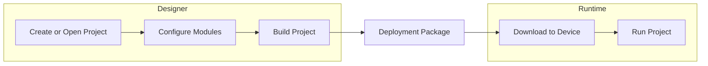

# AccuTrack SCADA – How to Use

**Version:** 1.0  
**Last Updated:** 2024  
**Applies to:** SCADA Designer (Qt C++), SCADA Runtime (Qt/QML)

---

## Table of Contents

1. [Introduction](#introduction)
2. [End-to-End Workflow](#end-to-end-workflow)
3. [Configuring Modules](#configuring-modules)
4. [Building the Project](#building-the-project)
5. [Transferring to Runtime](#transferring-to-runtime)
6. [Other Configurations](#other-configurations)
7. [Quick Reference](#quick-reference)

---

## Introduction

This document explains how to use the AccuTrack SCADA system from configuration in the Designer through deployment to the Runtime. It is intended for engineers and operators who need to configure all modules, build the project, and transfer it to a target device running AccuTrack Runtime.

- **Designer** is the desktop application where you create and configure projects (tags, alarms, screens, scripts, communication, and other modules).
- **Runtime** is the execution environment that loads the built project and runs data acquisition, control logic, visualization, and alarm handling.

For detailed step-by-step procedures on each feature, see the [AccuTrack Designer User Guide](AccuTrack%20Designer%20User%20Guide.md). For system scope and requirements, see the [AccuTrack – SCADA Requirements Specification (SRS)](AccuTrack%20%E2%80%93%20SCADA%20Requirements%20Specification%20(SRS).md).

---

## End-to-End Workflow

A typical workflow is:

1. **Create or open a project** in AccuTrack Designer.
2. **Configure all modules** (tags, communication, alarms, scripts, schedules, historian, security, and HMI screens) in an order that respects dependencies.
3. **Build the project** so that a deployment package is generated and validated.
4. **Transfer to runtime** by downloading the built project to the target device.
5. **Run** the project on the device using AccuTrack Runtime.

---

## Configuring Modules

Configure modules in the **Project View** (left panel) under your SCADA project. The order below is recommended when one module depends on another (e.g. tags and communication before screens and alarms).

### 1. Tags

**What it is:** The central database of process variables (inputs, outputs, and memory tags) used by screens, scripts, alarms, and communication.

**Where:** Project View → *Your SCADA project* → **Tags**. Double-click Tags or right-click → New Tag Table.

**Main actions:** Create tag tables, add tags, set name, type (Input/Output/Memory), data type, address (for I/O), scaling, units, and access level.

**Detail:** [Working with Tags](AccuTrack%20Designer%20User%20Guide.md#working-with-tags) in the Designer User Guide.

---

### 2. Communication

**What it is:** Connections to external devices (PLCs, sensors) via Modbus TCP/RTU, OPC UA, and other protocols. Tag addresses reference these connections.

**Where:** Project View → *Your SCADA project* → **Communication**. Double-click Communication Modules to open the editor.

**Main actions:** Add connections (e.g. Modbus TCP or OPC UA), set IP/port/credentials, then map device addresses to tags in the Tag Editor (e.g. `ModbusConnection1:40001`).

**Detail:** [Communication Setup](AccuTrack%20Designer%20User%20Guide.md#communication-setup) in the Designer User Guide.

---

### 3. Alarms

**What it is:** Alarm definitions (digital, analog thresholds, deviation, rate-of-change) with priority, severity, and actions.

**Where:** Project View → *Your SCADA project* → **Alarms**. Double-click or right-click → Open Alarms Editor.

**Main actions:** Add alarms, select tag, set type (digital/analog/etc.), thresholds, deadband, priority, severity, and latching/ack behaviour.

**Detail:** [Configuring Alarms](AccuTrack%20Designer%20User%20Guide.md#configuring-alarms) in the Designer User Guide.

---

### 4. Scripts

**What it is:** Lua scripts for custom logic (event-triggered, periodic, or startup/shutdown). Scripts can read/write tags and interact with alarms.

**Where:** Project View → *Your SCADA project* → **Scripts**. Right-click → New Script.

**Main actions:** Create scripts, write Lua code, use tag and alarm APIs; optionally schedule execution via the Schedules module.

**Detail:** [Scripting with Lua](AccuTrack%20Designer%20User%20Guide.md#scripting-with-lua) in the Designer User Guide.

---

### 5. Schedules

**What it is:** Scheduled execution of scripts (one-time, daily, weekly, monthly) for automation and reports.

**Where:** Project View → *Your SCADA project* → **Schedules**. Double-click Schedules to open the editor.

**Main actions:** Add schedule, choose type and timing, select script to run, set priority and retry options.

**Detail:** [Schedules and Automation](AccuTrack%20Designer%20User%20Guide.md#schedules-and-automation) in the Designer User Guide.

---

### 6. Historian

**What it is:** Data collection and storage for tags (sampling rate, deadband, retention) used by real-time and historical trends.

**Where:** Project View → *Your SCADA project* → **Historian**. Double-click Historian to open the editor.

**Main actions:** Select tags to collect, set sampling (periodic/on change/deadband), storage (buffer/archive), retention, and compression.

**Detail:** [Historical Data (Historian)](AccuTrack%20Designer%20User%20Guide.md#historical-data-historian) in the Designer User Guide.

---

### 7. Security

**What it is:** Users, groups, roles, and permissions (view, control, configure, admin) for tags, screens, scripts, alarms, and system settings.

**Where:** Project View → *Your SCADA project* → **Security**. Double-click Security to open the editor.

**Main actions:** Add users, assign roles, define groups, set permissions and access levels for resources; configure authentication and audit.

**Detail:** [Security Configuration](AccuTrack%20Designer%20User%20Guide.md#security-configuration) in the Designer User Guide.

---

### 8. Screens (HMI)

**What it is:** Operator screens built from components (buttons, gauges, trends, alarms, industrial symbols) with tag bindings and navigation.

**Where:** Project View → *Your SCADA project* → **Screens**. Double-click a screen or right-click → New Screen.

**Main actions:** Add components from the Components Palette, bind to tags, set appearance and events, configure screen properties and security.

**Detail:** [Creating HMI Screens](AccuTrack%20Designer%20User%20Guide.md#creating-hmi-screens) and [Using Components](AccuTrack%20Designer%20User%20Guide.md#using-components) in the Designer User Guide.

---

### 9. Settings (project-level)

**What it is:** Project-wide or runtime-related options (if available in your Designer version).

**Where:** Project View → **Settings** under the project root.

**Main actions:** Configure any project defaults, runtime startup, or platform-specific options exposed in the Designer UI. Full documentation may be expanded in a future User Guide update.

---

### 10. Machine Learning

**What it is:** Optional module for ML-related configuration (if enabled in your project).

**Where:** Project View → *Your SCADA project* → **Machine Learning**.

**Main actions:** Use as exposed in the Designer; detailed configuration is to be documented in the Designer User Guide when the feature is released.

---

## Building the Project

Before transferring to Runtime, the project must be built. The build validates configuration and produces a deployment package.

**When to build:** After configuring or changing tags, screens, scripts, communication, alarms, security, or other modules.

**Steps:**

1. **Build → Build Project** (or `Ctrl+B`).
2. Watch the **Output** tab for progress and errors.
3. If the build fails, fix the reported issues (e.g. invalid tag references, script syntax, missing files, invalid addresses) and rebuild.
4. Use **Build → Clean Project** to remove build artifacts before a fresh build if needed.

**What the build produces:**

- Deployment package (complete project package for Runtime)
- QML files for Runtime visualization
- JSON configuration
- Resource files (images, fonts, etc.)

**What is validated:**

- Tag references
- Screen references
- Lua script syntax
- Communication configuration
- Security configuration

**Detail:** [Building and Deploying](AccuTrack%20Designer%20User%20Guide.md#building-and-deploying) in the Designer User Guide.

---

## Transferring to Runtime

After a successful build, transfer the project to the device that runs AccuTrack Runtime.

### Download to Device

**Prerequisites:**

- AccuTrack Runtime must be installed on the target device.
- Network connectivity (for network deployment) or local access.
- Sufficient storage and required permissions on the device.

**Steps:**

1. **Download → Download to Device**.
2. Select the target device.
3. Configure deployment settings as needed.
4. Transfer the project package.
5. Verify deployment (e.g. confirm package on device or launch Runtime).

The Runtime loads the project package as read-only configuration; it does not modify tag structure or project layout.

### Upload from Device

To retrieve a project from a device (e.g. for backup or editing in Designer):

1. **Upload → Upload from Device**.
2. Connect to the device and select the project to upload.
3. Download the project package and open it in Designer.

**Detail:** [Building and Deploying – Deployment to Device](AccuTrack%20Designer%20User%20Guide.md#deployment-to-device) and [Upload from Device](AccuTrack%20Designer%20User%20Guide.md#upload-from-device) in the Designer User Guide.

---

## Other Configurations

- **Project-level settings:** Use **Settings** in the Project View for any project-wide or runtime options offered by your Designer version.
- **Default or start screen:** Configure which screen Runtime shows at startup (if supported in project or Runtime settings).
- **Runtime startup:** Ensure the target device starts Runtime (or the appropriate executable) and loads the deployed project; platform-specific startup is outside the Designer.
- **Environment:** For network deployment, ensure firewall and port access allow communication between Designer and the device.

---

## Quick Reference

| I want to… | Do this |
|------------|--------|
| Create a new project | File → New Project; save as `.isc`. |
| Configure tags | Project View → *SCADA project* → Tags; see [Working with Tags](AccuTrack%20Designer%20User%20Guide.md#working-with-tags). |
| Configure Modbus/OPC UA | Project View → Communication → add connection; map addresses in Tags. See [Communication Setup](AccuTrack%20Designer%20User%20Guide.md#communication-setup). |
| Configure alarms | Project View → Alarms → Open Alarms Editor; see [Configuring Alarms](AccuTrack%20Designer%20User%20Guide.md#configuring-alarms). |
| Add Lua scripts | Project View → Scripts → New Script; see [Scripting with Lua](AccuTrack%20Designer%20User%20Guide.md#scripting-with-lua). |
| Schedule scripts | Project View → Schedules; see [Schedules and Automation](AccuTrack%20Designer%20User%20Guide.md#schedules-and-automation). |
| Configure historian/trending | Project View → Historian; see [Historical Data (Historian)](AccuTrack%20Designer%20User%20Guide.md#historical-data-historian). |
| Configure users and security | Project View → Security; see [Security Configuration](AccuTrack%20Designer%20User%20Guide.md#security-configuration). |
| Design HMI screens | Project View → Screens; see [Creating HMI Screens](AccuTrack%20Designer%20User%20Guide.md#creating-hmi-screens). |
| Build the project | Build → Build Project (`Ctrl+B`); check Output tab. See [Building and Deploying](AccuTrack%20Designer%20User%20Guide.md#building-and-deploying). |
| Deploy to device | Build first, then Download → Download to Device; select target and transfer. |
| Get project from device | Upload → Upload from Device; select project and open in Designer. |
